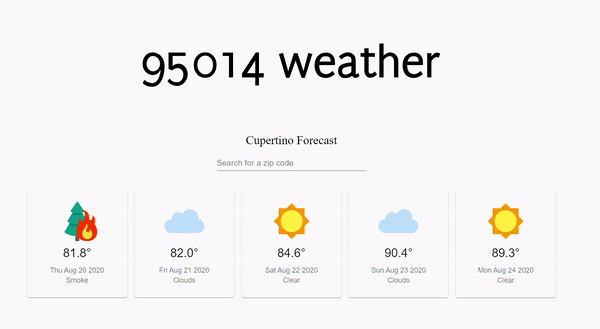

# 95014-Weather-App
A weather app created with ReactJS that gives a simple 5 day weather forecast for any zipcode in the US. OpenWeatherAPI provides the forecast information, while Zip-Code API was used for the zipcode look up and validation. Material UI was used for components like the card and search bar.

This project was bootstrapped with [Create React App](https://github.com/facebook/create-react-app).

### [View a working deployment of this app on Heroku](https://weather-95014.herokuapp.com/)

## Screenshots

## Motivation 
The app was born out of curiosity! I wanted to play around with ReactJS and build something by myself. This is my first project using React.
The animated text that loads at the beginning of the screen was done with the help of a HTML/CSS tutorial, just for added fun and experimentation.

### What This Project Helped Me With:
<ul>
  <li>Better understanding of states and components in React</li>
  <li>How to create a search bar with React</li>
  <li>How to access API endpoints</li>
  <li>Working with JSON format data</li>
  <li>How to properly store API keys in environment variables</li>
  <li>Introduction to animating SVG images with CSS</li>
</ul>

### Possible Future Changes:
<ul>
  <li>Displaying more detailed weather information through a card that expands to show more information</li>
  <li>Better UI design</li>
</ul>

## Available Scripts

In the project directory, you can run:

### `npm start`

Runs the app in the development mode. 
Open [http://localhost:3000](http://localhost:3000) to view it in the browser.

## Languages/Framework/Libraries
Javascript, ReactJS, MaterialUI, HTML/CSS

## API Reference 
[Current Weather Data from OpenWeather](https://openweathermap.org/current)  
[5 day / 3 hour Forecast Data from Open Weather](https://openweathermap.org/forecast5)  
[Zip Code Data](https://www.zip-codes.com/zip-code-api-documentation.asp)  
[Weather Icons](https://icons8.com) 
